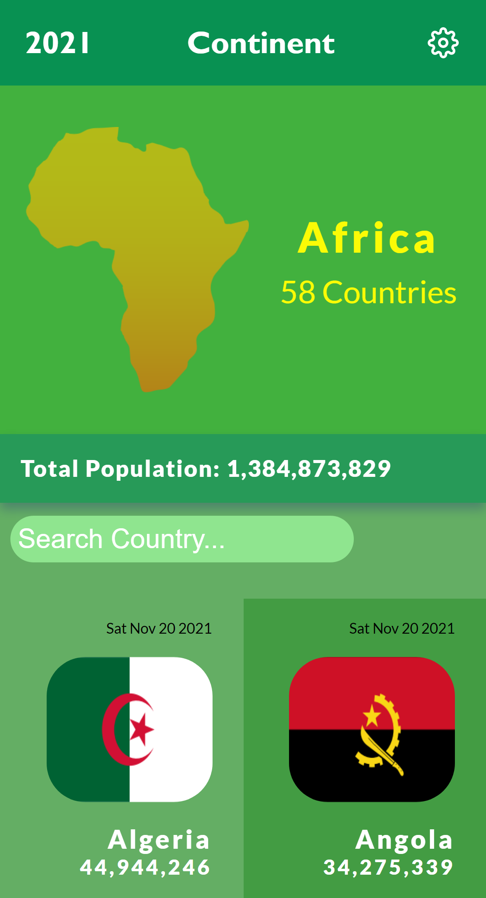

# Air Pollution Report Centre
This project was bootstrapped with [Create React App](https://github.com/facebook/create-react-app) and Redux.


> The Air Pollution Report Centre project is a web application that provides detailed metrices of several air pollutants in the athmosphere for a particular country in Africa.


## Screenshot
> |Rocket Section|Missions Version|
> |--------------|----------------|
> |||!

## Brief Demo

> 

This **Single Page App**  was built with **React-Redux**. The main page `(Continent Page)` was built using data gotten from this [Covid19 API](https://disease.sh/v3/covid-19/countries). The main page renders the following details about African Countries and Islands in the `ReactDOM`:
- Total Population of people in Africa
- The current date
- Each country's flag and 
- Each Country's Population

Each country's card has links to its particular page that displays the country's air pollution data for emmisions of air pollutants into the athmosphere.

The project uses _React's `useLocation()`_ to link to each country's page and modify the _`URL Path`_ for each country

The `Country's Page` was built using data fetched from this [Air Pollution API](https://openweathermap.org/api/air-pollution). The API takes the latitude and longitude of each country as a parameter in its URL Path before data from the API can be successfully fetched. The latitude and longitude for each country was passed from the React Router's Link using the state key in the uselocation() object.

The country page displays the data about the emission of the following air pollutants into athmosphere for each country:
- Carbon Monoxide (CO)
- Nitrogen monoxide (NO)
- Nitrogen dioxide (NO2)
- Ozone (O3)
- Sulphur dioxide (SO2)
- Ammonia (NH3)
- and particulates (PM2.5 and PM10).

The following key can be used to understand the metrices displayed on each country's page:

| Qualitative name | Index | Pollutant concentration in μg/m3 |
|----------------|-----|-----------------------------|
|                |     | NO2	PM10	O3	PM25 (optional) |
| Good	         | 1	 | 0-50	0-25	0-60	0-15 |
| Fair	         | 2	 | 50-100	25-50	60-120	15-30 |
| Moderate	     |  3	 | 100-200	50-90	120-180	30-55 |
| Poor	         |  4	 | 200-400	90-180	180-240	55-110 |
| Very Poor	     |  5	 | >400	>180	>240	>110 |

You can learn more about calculation of Air Quality index by clicking this [Link](https://en.wikipedia.org/wiki/Air_quality_index#CAQI)


## Built With

- ### Major languages
  - Javascript, CSS
- ### Frameworks
  - ReactJS, Redux, React-Redux, React Bootstrap
- ### Technologies used
  - Webpack, Babelrc, Linters

## Live Demo Links

🔗 [Live Demo Link](https://air-pollution-centre.herokuapp.com/)

## Getting Started

To get a local copy up and running follow these simple example steps.

```
git clone https://github.com/Gambit142/AirPollution-Report-Centre.git
```

and then run

```
npm i
npm start
```

## Installation

to build a production version to `bulid` folder run

```
npm run build
```

## Authors

👨🏿 **Francis Ugorji**

- GitHub: [@Gambit142](https://github.com/Gambit142)
- LinkedIn: [Francis Ugorji](https://www.linkedin.com/in/francis-ugorji/)


## 🤝 Contributing

Contributions, issues, and feature requests are welcome!

Feel free to check the [issues page](https://github.com/Gambit142/AirPollution-Report-Centre/issues).

## Show your support

Give a ⭐️ if you like this project!

## Acknowledgments

- Hat tip to [Microverse](https://www.microverse.org/) for the opprotunity to learn ReactJS and React_Redux using their platform
- The [COVID19 API](https://disease.sh/v3/covid-19/countries) was used to retrieve data that was displayed on the Continent Page _(Home Page)_
- The [AIR POLLUTION API](https://openweathermap.org/api/air-pollution) was used to retrieve data that was displayed on the Country Page _(Home Page)_
- The UI for the page was designed using a this [Behance](https://www.behance.net/gallery/31579789/Ballhead-App-%28Free-PSDs%29) template by **Nelson Sakwa**
- The background image used on the Country's Page was gotten from **Pexel's website** captured by _Leboutillier_